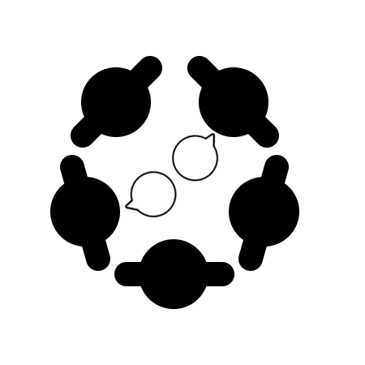

# ThaiMoung 

  
ThaiMoung is a web forum application that provides services to create forums for dramas in Thailand.

## Project Documents

[Home](../../wiki/Home)  
[Proposal](https://docs.google.com/document/d/1rzrv2o_gZU1Uh3EQ-Ona6EIYkrj8onRlVrpoh9FInAI/edit#)  
[Installation](../../wiki/Installation)  
[Vision Statement](../../wiki/Vision%20Statement)  
[Requirements](../../wiki/Requirements)   

### Code review
* [Script](../../wiki/Script)  
* [Checklist](../../wiki/Checklist)  

## Iteration

### Iteration Plans  
* [Iteration 1 Plan](../../wiki/Iteration%201%20Plan)  
* [Iteration 2 Plan](../../wiki/Iteration%202%20Plan)  
* [Iteration 3 Plan](../../wiki/Iteration%203%20Plan)
* [Iteration 4 Plan](../../wiki/Iteration%204%20Plan) 
* [Iteration 5 Plan](../../wiki/Iteration%205%20Plan)
* [Iteration 6 Plan](../../wiki/Iteration%206%20Plan)
* [Iteration 7 Plan](../../wiki/Iteration%207%20Plan)

### Iteration TaskBoards  
* [Iteration 1 TaskBoard](../../projects/2)  
* [Iteration 2 TaskBoard](../../projects/3)  
* [Iteration 3 TaskBoard](../../projects/5)  
* [Iteration 4 TaskBoard](../../projects/6)
* [Iteration 5 TaskBoard](../../projects/7)
* [Iteration 6 TaskBoard](../../projects/8)
* [Iteration 7 TaskBoard](../../projects/9)
## License
[MIT License](https://github.com/Jakarin-Jojo/ThaiMoung/blob/master/LICENSE)
